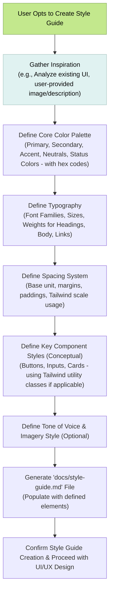
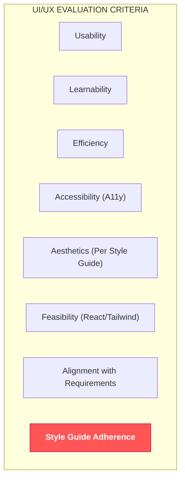

# CREATIVE PHASE: UI/UX DESIGN

> **TL;DR:** This document outlines the structured approach for UI/UX design decisions during the Creative Phase. It ensures user-centric designs, exploration of multiple options, adherence to a style guide (if available or created), and clear documentation of UI/UX choices, aligning with React/Tailwind best practices.

## 🎨 UI/UX Design Philosophy

* **User-Centricity**: Designs must prioritize the user's needs, goals, and context.
* **Clarity & Simplicity**: Interfaces should be intuitive and easy to understand.
* **Consistency**: Maintain consistency with established design patterns, project-specific styles, and platform conventions.
* **Accessibility (A11y)**: Adhere to WCAG guidelines to ensure usability for people with disabilities.
* **Efficiency**: Enable users to accomplish tasks with minimal effort.
* **Feedback**: Provide clear and timely feedback for user actions.
* **Visual Cohesion**: Ensure new UI elements align with the existing or defined project style guide.

## 🌊 UI/UX Design Workflow

This workflow guides the UI/UX design process within the Creative Phase, incorporating a crucial style guide check.

```mermaid
graph TD
    Start["UI/UX Design Start"] --> StyleGuideCheck["0. Style Guide Check<br>Attempt to locate 'docs/style-guide.md' or user-provided path."]
    StyleGuideCheck --> HasStyleGuide{"Style Guide<br>Available/Loaded?"}

    HasStyleGuide -- "Yes" --> Understand["1. Understand User & Task<br>(Personas, User Stories, Requirements)"]
    HasStyleGuide -- "No" --> PromptCreateStyleGuide["Prompt User:<br>Create/Link Style Guide?"]

    PromptCreateStyleGuide --> UserResponse{"User Opts to<br>Create/Link?"}
    UserResponse -- "Yes, Create" --> DefineStyleGuideSubProcess["SUB-PROCESS:<br>Define Basic Style Guide"]
    UserResponse -- "Yes, Link" --> LinkStyleGuide["User provides path/URL.<br>Load Style Guide."]
    UserResponse -- "No" --> Understand_NoGuide["1. Understand User & Task<br>(Proceeding without Style Guide - WARN user of inconsistencies)"]

    DefineStyleGuideSubProcess --> StyleGuideCreated["Basic 'style-guide.md' Created/Defined"]
    StyleGuideCreated --> Understand
    LinkStyleGuide --> Understand
    Understand_NoGuide --> InfoArch_NoGuide["2. Information Architecture"]

    Understand --> InfoArch["2. Information Architecture<br>(Structure, Navigation, Content Hierarchy)"]
    InfoArch --> Interaction["3. Interaction Design<br>(User Flows, Wireframes, Prototypes - Conceptual)"]
    Interaction --> VisualDesign["4. Visual Design<br>(<b>APPLY STYLE GUIDE</b>, Leverage React/Tailwind, Mockups - Conceptual)"]
    VisualDesign --> Options["5. Explore UI/UX Options<br>(Generate 2-3 distinct solutions)"]
    Options --> Evaluate["6. Evaluate Options<br>(Usability, Feasibility, A11y, Aesthetics, <b>Style Guide Alignment</b>)"]
    Evaluate --> Decision["7. Make & Document UI/UX Decision<br>(Use Optimized Creative Template)"]
    Decision --> Validate["8. Validate Against Requirements, Principles & <b>Style Guide</b>"]
    Validate --> UIUX_Complete["UI/UX Design Complete for Component"]

    InfoArch_NoGuide --> Interaction_NoGuide["3. Interaction Design"]
    Interaction_NoGuide --> VisualDesign_NoGuide["4. Visual Design<br>(Leverage React/Tailwind, Aim for Internal Consistency)"]
    VisualDesign_NoGuide --> Options_NoGuide["5. Explore UI/UX Options"]
    Options_NoGuide --> Evaluate_NoGuide["6. Evaluate Options<br>(Usability, Feasibility, A11y, Aesthetics)"]
    Evaluate_NoGuide --> Decision_NoGuide["7. Make & Document UI/UX Decision"]
    Decision_NoGuide --> Validate_NoGuide["8. Validate Against Requirements & Principles"]
    Validate_NoGuide --> UIUX_Complete

    style Start fill:#4da6ff,stroke:#0066cc,color:white
    style StyleGuideCheck fill:#ab87ff,stroke:#7d5bbe,color:white
    style HasStyleGuide fill:#ab87ff,stroke:#7d5bbe,color:white
    style PromptCreateStyleGuide fill:#ffcb6b,stroke:#f9a825,color:black
    style UserResponse fill:#ffcb6b,stroke:#f9a825,color:black
    style DefineStyleGuideSubProcess fill:#c3e88d,stroke:#82a75c,color:black
    style LinkStyleGuide fill:#c3e88d,stroke:#82a75c,color:black
    style StyleGuideCreated fill:#c3e88d,stroke:#82a75c,color:black
    style VisualDesign fill:#4dbbbb,stroke:#368787,color:white
    style Evaluate fill:#d971ff,stroke:#a33bc2,color:white
    style Validate fill:#71c2ff,stroke:#3b8aa3,color:white
    style Understand_NoGuide fill:#ff8a80,stroke:#c85a54,color:black
    style UIUX_Complete fill:#5fd94d,stroke:#3da336,color:white
```

## Style Guide Integration
A consistent visual style is paramount for good UI/UX. This section details how to reference an existing style guide or prompt for its creation.

Step 0: Style Guide Check & Handling
A. Checking for an Existing Style Guide:

Default Location Check: The system will first look for style-guide.md or design-system.md in:
docs/style-guide.md
The project root: style-guide.md
(Future Enhancement: A predefined Memory Bank variable for the style guide path).
Ask the User: If not found automatically, prompt:
"I couldn't automatically locate a project style guide. Is there an existing style guide I should reference? If so, please provide the file path or URL. Otherwise, we can create a basic one or proceed without (not recommended)."
B. Using an Existing Style Guide:

If a style guide is provided or found:
Load its content into context.
CRITICAL: All subsequent UI/UX design proposals (colors, typography, spacing, component appearance) MUST adhere strictly to this guide.
When evaluating options (Step 6), "Adherence to Style Guide" becomes a key criterion.
C. If No Style Guide Exists or is Provided (User Interaction):

The system should strongly recommend creating one:
"No style guide has been referenced. For optimal UI consistency and development efficiency, creating even a basic style guide is highly recommended."

"Would you like to:"
"1. Create a basic style guide now? (I can help you define core elements like colors, typography, and spacing based on observations or your input.)"
"2. Provide a path/URL to an existing style guide if you know one?"
"3. Proceed with UI/UX design without a style guide? (This may lead to inconsistencies and is not recommended for new features.)"
"Please choose 1, 2, or 3."
D. Assisting in Style Guide Creation (If user opts-in for option 1):
This initiates a sub-process to define and document a basic style guide.

### Process:

Inspiration: If an image (like the dashboard example) or existing UI parts are available, analyze them for common styles. Otherwise, ask the user for preferences.
AI: "To create a style guide, do you have an existing design, screenshot, or website I can analyze for styles? Or would you like to define them from scratch?"
Colors: Extract or ask for primary, secondary, accent, neutral, and status colors.
AI: "Based on [inspiration/your input], I've identified/suggest these colors: Primary: #XXXXXX. Is this correct? What about secondary and accent colors?"
Typography: Extract or ask for font families, base font size, and scale.
AI: "The main font appears to be a [Sans-Serif type]. Do you have a specific font name? What's the base font size?"
Spacing: Extract or ask for base spacing unit or Tailwind scale usage.
AI: "I observe [consistent padding/margin patterns]. Shall we adopt an 8px base unit system, or stick to Tailwind's spacing scale (e.g., p-4, m-2)?"
Key Components: For common components, define their general appearance or key Tailwind classes.
AI: "For a primary button, the style seems to be [describe observed style, e.g., 'bg-yellow-400 text-black rounded-lg']. Does this capture it?"
Documentation: Generate a docs/style-guide.md file. (A sample template for this file was created in our previous interaction based on the image).
Once the style guide is created/loaded, it becomes the single source of truth for visual design for the remainder of the project.

🖼️ Key UI/UX Design Considerations (To be applied using the Style Guide)
1. User Needs Analysis
Personas: Define target user personas.
User Stories/Jobs-to-be-Done: Clarify what users need to achieve.
Use Cases: Detail specific interaction scenarios.
2. Information Architecture (IA)
Content Inventory & Audit: Understand existing content.
Hierarchy & Structure: Organize content logically.
Navigation Design: Design intuitive navigation (menus, breadcrumbs) adhering to style guide for appearance.
Labeling: Use clear and consistent labels.
3. Interaction Design (IxD)
User Flows: Map out the user's path.
Wireframes: Create low-fidelity layouts.
Prototypes (Conceptual): Describe interactive elements and transitions.
Error Handling & Prevention: Design clear error messages (styled per guide).
Feedback Mechanisms: Implement visual/textual feedback (styled per guide).
4. Visual Design (Strictly follow the Style Guide)
Style Guide Adherence: CRITICAL - All visual choices MUST conform to docs/style-guide.md.
Visual Hierarchy: Use Style Guide's typography and spacing to guide the user.
Layout & Composition: Arrange elements effectively using Tailwind CSS and style guide spacing.
Typography: Apply defined font families, sizes, and weights from the Style Guide.
Color Palette: Exclusively use colors defined in the Style Guide.
Imagery & Iconography: Use icons and images that match the Style Guide's defined style.
Branding: Align with project branding guidelines as documented in the Style Guide.
5. Accessibility (A11y)
WCAG Compliance Level: Target AA or AAA.
Semantic HTML.
Keyboard Navigation.
ARIA Attributes.
Color Contrast: Verify against Style Guide colors.
Alternative Text.
6. Platform & Responsiveness
Responsive Design: Ensure UI adapts to screen sizes using Style Guide's responsive principles (if defined).
Platform Conventions: Adhere to UI patterns for the target platform(s).
🛠️ UI/UX Option Evaluation & Decision Making
Refer to optimized-creative-template.mdc. Key evaluation criteria include:

Usability
Learnability
Efficiency
Accessibility
Aesthetics (as defined by the Style Guide)
Feasibility (React/Tailwind)
Alignment with Requirements
Adherence to Style Guide (CRITICAL if guide exists)
Code snippet

📝 Documentation Standards
Use optimized-creative-template.mdc for documenting UI/UX decisions.
Clearly describe chosen UI patterns and rationale, referencing the Style Guide.
Document considerations for responsive states and accessibility, as guided by the Style Guide.
✅ UI/UX Design Verification Checklist
[ ] Style Guide referenced or created?
[ ] User needs clearly understood and addressed?
[ ] Information architecture logical and intuitive?
[ ] Interaction design clear and efficient?
[ ] Visual design strictly adheres to the Style Guide?
[ ] Accessibility standards met?
[ ] Responsive design addressed?
[ ] Design decisions documented with rationale and Style Guide references?
[ ] Alignment with React/Tailwind best practices and Style Guide considered?
🔄 Integration with Other Creative Phases
Architecture Design: Ensure UI/UX is compatible with system architecture.
Data Model Design: UI should effectively present/capture data from the data model.
Style Guide: All UI/UX work must be a direct application or extension of the established style guide.
