# Memory Bank System v1.0.0 (Customized)

A token-optimized, hierarchical task management system that integrates with Cursor custom modes for efficient development workflows, **with custom command support**.

```mermaid
graph TD
    Main["Memory Bank System<br>v1.0.0 Customized"] --> Modes["Custom Modes"]
    Main --> Rules["Hierarchical Rule Loading"]
    Main --> Visual["Visual Process Maps"]
    Main --> Token["Token Optimization"]
    Main --> Custom["Custom Commands"]
    
    Modes --> VAN["VAN: Initialization"]
    Modes --> PLAN["PLAN: Task Planning"]
    Modes --> CREATIVE["CREATIVE: Design"]
    Modes --> IMPLEMENT["IMPLEMENT: Building"]
    Modes --> REFLECT["REFLECT: Review"]
    Modes --> ARCHIVE["ARCHIVE: Documentation"]
    
    Custom --> VanCmd["van / VAN"]
    Custom --> PlanCmd["plan / PLAN"]
    Custom --> CreativeCmd["arh / CREATIVE"]
    Custom --> ImplementCmd["do / IMPLEMENT"]
    Custom --> QACmd["qa / QA"]
    Custom --> ReflectCmd["sum / REFLECT"]
    
    style Main fill:#4da6ff,stroke:#0066cc,color:white
    style Modes fill:#f8d486,stroke:#e8b84d,color:black
    style Rules fill:#80ffaa,stroke:#4dbb5f,color:black
    style Visual fill:#d9b3ff,stroke:#b366ff,color:black
    style Token fill:#ff9980,stroke:#ff5533,color:black
    style Custom fill:#ffcc99,stroke:#ff9933,color:black
```

> **Personal Note**: Memory Bank is my personal hobby project that I develop for my own use in coding projects. As this is a personal project, I don't maintain an issues tracker or actively collect feedback. However, if you're using these rules and encounter issues, one of the great advantages is that you can ask the Cursor AI directly to modify or update the rules to better suit your specific workflow. The system is designed to be adaptable by the AI, allowing you to customize it for your own needs without requiring external support.

## 🚀 What's New in v1.0.0

This fork adds **custom command support** to Memory Bank while maintaining full backward compatibility:

### ✨ New Custom Commands
- `van` → VAN Mode (alternative to `VAN`)
- `plan` → PLAN Mode (alternative to `PLAN`)
- `arh` → CREATIVE Mode (alternative to `CREATIVE`)
- `do` → IMPLEMENT Mode (alternative to `IMPLEMENT`)
- `qa` → QA Mode (alternative to `QA`)
- `sum` → REFLECT Mode (alternative to `REFLECT`)

### ✅ Backward Compatibility
All original commands continue to work:
- `VAN`, `PLAN`, `CREATIVE`, `IMPLEMENT`, `QA`, `REFLECT`, `ARCHIVE`

### 🔧 Easy Installation
- Automatic installation script: `./install.sh`
- Manual installation instructions
- Comprehensive testing tools

## About Memory Bank

Memory Bank is a personal project that provides a structured approach to development using specialized modes for different phases of the development process. It uses a hierarchical rule loading architecture that loads only the rules needed for each phase, optimizing token usage and providing tailored guidance.

### Token-Optimized Architecture

Version 1.0.0 introduces custom command support while maintaining all v0.7-beta optimizations:

- **Hierarchical Rule Loading**: Only loads essential rules initially with specialized lazy-loading
- **Progressive Documentation**: Implements concise templates that scale with task complexity
- **Optimized Mode Transitions**: Preserves critical context efficiently between modes
- **Level-Specific Workflows**: Adapts documentation requirements to task complexity
- **Custom Command Support**: Flexible command system with backward compatibility

See the [Memory Bank Optimizations](MEMORY_BANK_OPTIMIZATIONS.md) document for detailed information about all optimization approaches.

### Beyond Basic Custom Modes

While Cursor's documentation describes custom modes as primarily standalone configurations with basic prompts and tool selections, Memory Bank significantly extends this concept:

- **Graph-Based Mode Integration**: Modes are interconnected nodes in a development workflow rather than isolated tools
- **Workflow Progression**: Modes are designed to transition from one to another in a logical sequence (VAN → PLAN → CREATIVE → IMPLEMENT → REFLECT → ARCHIVE)
- **Shared Memory**: Persistent state maintained across mode transitions via Memory Bank files
- **Adaptive Behavior**: Each mode adjusts its recommendations based on project complexity
- **Built-in QA Functions**: QA capabilities can be called from any mode for technical validation
- **Custom Commands**: Flexible command system supporting both original and custom commands

This approach transforms custom modes from simple AI personalities into components of a coordinated development system with specialized phases working together.

## Key Features

- **Hierarchical Rule Loading**: Load only the essential rules with specialized lazy-loading
- **Progressive Documentation**: Concise templates that scale with task complexity
- **Unified Context Transfer**: Efficient context preservation between modes
- **Mode-Specific Visual Maps**: Clear visual representations for each development phase
- **Level-Specific Workflows**: Adapted processes based on complexity (Levels 1-4)
- **Platform-Aware Commands**: Automatically adapts commands to your operating system
- **Custom Command Support**: Flexible command system with backward compatibility

## Installation Instructions

### Prerequisites

- **Cursor Editor**: Version 0.48 or higher is required.
- **Custom Modes**: Feature must be enabled in Cursor (Settings → Features → Chat → Custom modes).
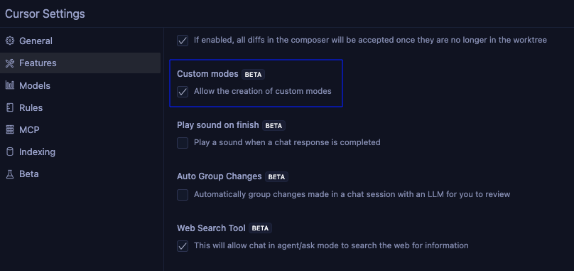

- **AI Model**: Claude 4 Sonnet or Claude 4 Opus is recommended for best results, especially for CREATIVE mode's "Think" tool methodology.

### Step 1: Get the Files

Clone this customized repository into your project directory:

```
git clone https://github.com/YOUR_USERNAME/cursor-memory-bank.git
```

#### Alternative (Manual)

After extracting it from the ZIP file, follow the steps below.

- Copy the `.cursor` and `custom_modes` folders to the project directory

Note: other documents are not necessary for memory bank operation, they are explanatory documents. You can copy them to a folder like `memory_bank_documents`.

### Step 2: Install Custom Commands (Optional)

#### Automatic Installation
```bash
chmod +x install.sh
./install.sh
```

#### Manual Installation
1. Create a backup of the original `custom_modes/van_instructions.md`
2. The customized version is already included in this fork

### Step 3: Setting Up Custom Modes in Cursor

**This is the most critical and challenging part of the setup.** You'll need to manually create six custom modes in Cursor and copy the instruction content from the provided files:

#### How to Add a Custom Mode in Cursor

1. Open Cursor and click on the mode selector in the chat panel
2. Select "Add custom mode"
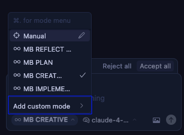

3. In the configuration screen:
   - Enter the mode name (you can include emoji icons like 🔍, 📋, 🎨, ⚒️ by copy-pasting them at the beginning of the name)
   - Select an icon from Cursor's limited predefined options
   - Add a shortcut (optional)
   - Check the required tools
   - Click on **Advanced options**
   - In the empty text box that appears at the bottom, paste the custom instruction content from the corresponding file

#### Mode Configuration

For each mode, configure as follows (If MCPs are showing, you can keep them on, they probably won't work):

1. **VAN MODE** (Initialization)
   - **Name**: 🔍 VAN
   - **Tools**: Enable "Codebase Search", "Read File", "Terminal", "List Directory", "Fetch Rules"
   - **Advanced options**: Paste from `custom_modes/van_instructions.md`


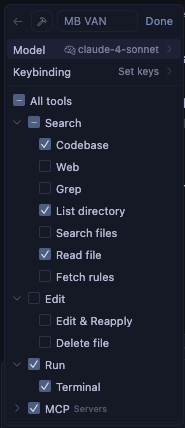 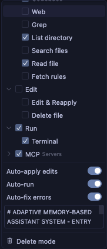

2. **PLAN MODE** (Task Planning)
   - **Name**: 📋 PLAN
   - **Tools**: Enable "Codebase Search", "Read File", "Terminal", "List Directory"
   - **Advanced options**: Paste from `custom_modes/plan_instructions.md`

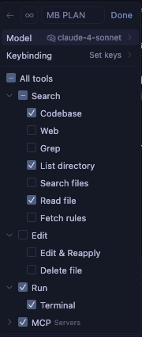 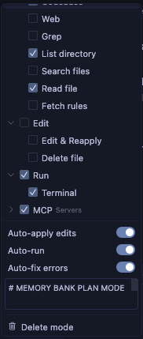

3. **CREATIVE MODE** (Design Decisions)
   - **Name**: 🎨 CREATIVE
   - **Tools**: Enable "Codebase Search", "Read File", "Terminal", "List Directory", "Edit File", "Fetch Rules"
   - **Advanced options**: Paste from `custom_modes/creative_instructions.md`

 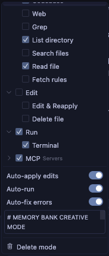

4. **IMPLEMENT MODE** (Code Implementation)
   - **Name**: ⚒️ IMPLEMENT
   - **Tools**: Enable all tools
   - **Advanced options**: Paste from `custom_modes/implement_instructions.md`

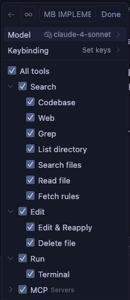 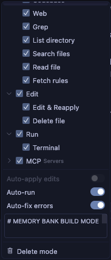

5. **REFLECT & ARHIVE MODE** (Review)
   - **Name**: 🔍 REFLECT or ARCHIVE
   - **Tools**: Enable "Codebase Search", "Read File", "Terminal", "List Directory"
   - **Advanced options**: Paste from `custom_modes/reflect_archive_instructions.md`

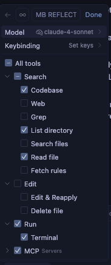 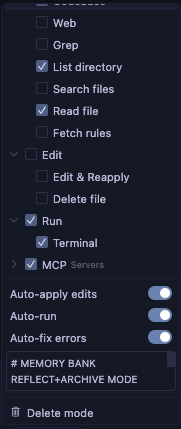
   

> **Note**: REFLECT and ARCHIVE instructions are combined in a single file and mode to optimize for Cursor's character and custom mode limits  while maintaining functionality. Thanks to GitHub user @joshmac007 for implementing this optimization.

For additional help on setting up custom modes in Cursor, refer to the [official Cursor documentation on custom modes](https://docs.cursor.com/chat/custom-modes).

### QA Functionality

QA is not a separate custom mode but rather a set of validation functions that can be called from any mode. You can invoke QA capabilities by typing "QA" or "qa" in any mode when you need to perform technical validation. This approach provides flexibility to conduct verification at any point in the development process.

## Basic Usage

1. **Start with VAN Mode**:
   - Switch to VAN mode in Cursor
   - Type "VAN" or "van" to initiate the initialization process
   - VAN will analyze your project structure and determine complexity

2. **Follow the Workflow Based on Complexity**:
   - **Level 1 tasks**: May proceed directly to IMPLEMENT after VAN
   - **Level 2 tasks**: Simplified workflow (VAN → PLAN → IMPLEMENT → REFLECT)
   - **Level 3-4 tasks**: Full workflow (VAN → PLAN → CREATIVE → IMPLEMENT → REFLECT → ARCHIVE)
   - **At any point**: Type "QA" or "qa" to perform technical validation


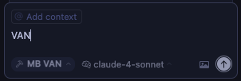  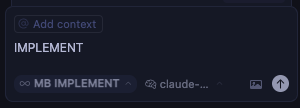 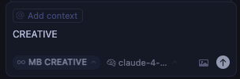  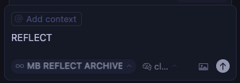 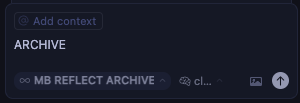

3. **Mode-Specific Commands**:
   ```
   # Original Commands (still work)
   VAN - Initialize project and determine complexity
   PLAN - Create detailed implementation plan
   CREATIVE - Explore design options for complex components
   IMPLEMENT - Systematically build planned components
   REFLECT - Review and document lessons learned
   ARCHIVE - Create comprehensive documentation
   QA - Validate technical implementation (can be called from any mode)
   
   # New Custom Commands
   van - Initialize project and determine complexity
   plan - Create detailed implementation plan
   arh - Explore design options for complex components
   do - Systematically build planned components
   sum - Review and document lessons learned
   qa - Validate technical implementation (can be called from any mode)
   ```

4. **Starting to work with your project**:
   
After successfully installing Memory Bank...

## Core Files and Their Purposes

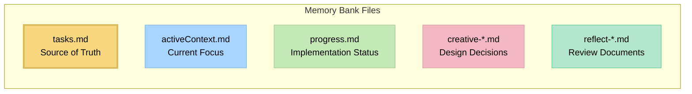

- **tasks.md**: Central source of truth for task tracking
- **activeContext.md**: Maintains focus of current development phase
- **progress.md**: Tracks implementation status
- **creative-*.md**: Design decision documents generated during CREATIVE mode
- **reflect-*.md**: Review documents created during REFLECT mode

## Customization

### Custom Commands
This fork adds custom command support to Memory Bank. You can use either original commands or new custom commands:

| Original | Custom | Mode | Description |
|----------|--------|------|-------------|
| `VAN` | `van` | VAN | Initialize project |
| `PLAN` | `plan` | PLAN | Task planning |
| `CREATIVE` | `arh` | CREATIVE | Design decisions |
| `IMPLEMENT` | `do` | IMPLEMENT | Code implementation |
| `QA` | `qa` | QA | Technical validation |
| `REFLECT` | `sum` | REFLECT | Review and reflection |

### Installation
```bash
# Automatic installation
chmod +x install.sh
./install.sh

# Manual installation
cp custom_modes/van_instructions.md /path/to/your/memory-bank/
```

### Testing
```bash
# Test new commands
cat test_commands.md

# Test in Cursor
van    # Should activate VAN Mode
plan   # Should activate PLAN Mode
arh    # Should activate CREATIVE Mode
do     # Should activate IMPLEMENT Mode
qa     # Should activate QA Mode
sum    # Should activate REFLECT Mode
```

### Restoration
```bash
# Restore original commands
cp cursor-memory-bank/custom_modes/van_instructions.md.backup \
   cursor-memory-bank/custom_modes/van_instructions.md
```

## Troubleshooting

### Common Issues

1. **Mode not responding correctly**:
   - Verify custom instructions were copied completely (this is the most common issue)
   - Ensure the correct tools are enabled for each mode
   - Check that you've switched to the correct mode before issuing commands
   - Make sure you pasted the instructions in the "Advanced options" text box

2. **Custom commands not working**:
   - Verify that `custom_modes/van_instructions.md` contains the custom commands
   - Check that the file was properly copied during installation
   - Ensure you're using the correct command syntax

3. **Rules not loading**:
   - Make sure the `.cursor/rules/isolation_rules/` directory is in the correct location
   - Verify file permissions allow reading the rule files

4. **Command execution issues**:
   - Ensure you're running commands from the correct directory
   - Verify platform-specific commands are being used correctly

## Version Information

This is version v1.0.0 of the Memory Bank system, based on v0.7-beta with custom command support. It introduces custom command functionality while maintaining all v0.7-beta optimizations.

### Changes from v0.7-beta
- ✅ Added custom command support
- ✅ Maintained full backward compatibility
- ✅ Added REFLECT & ARCHIVE support
- ✅ Created comprehensive documentation
- ✅ Added installation and testing tools

### Ongoing Development

The Memory Bank system is actively being developed and improved. Key points to understand:

- **Work in Progress**: This is a customized version with ongoing development. Expect regular updates, optimizations, and new features.
- **Feature Optimization**: The modular architecture enables continuous refinement without breaking existing functionality.
- **Custom Command Support**: Flexible command system that can be easily extended.
- **Architectural Benefits**: Before deciding which version to use, please read the [Memory Bank Upgrade Guide](memory_bank_upgrade_guide.md) to understand the significant benefits of the new architecture.

## Resources

- [Memory Bank Optimizations](MEMORY_BANK_OPTIMIZATIONS.md) - Detailed overview of token efficiency improvements
- [Release Notes](RELEASE_NOTES.md) - Information about the latest changes
- [Cursor Custom Modes Documentation](https://docs.cursor.com/chat/custom-modes)
- [Memory Bank Upgrade Guide](memory_bank_upgrade_guide.md)
- [CREATIVE Mode and Claude's "Think" Tool](creative_mode_think_tool.md)
- [Customization Guide](CUSTOMIZATION.md) - Detailed information about custom commands
- [Changelog](CHANGELOG.md) - History of changes in this fork
- Mode-specific instruction files in the `custom_modes/` directory

---

*Note: This README is for v1.0.0 customized version and subject to change as the system evolves.* 